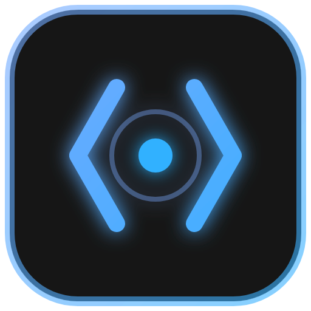
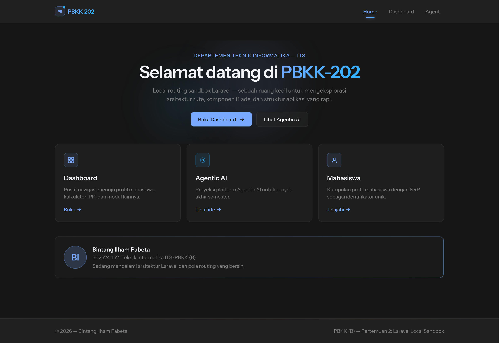
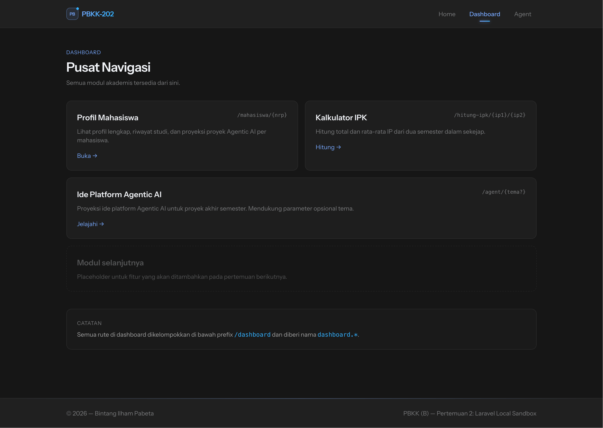
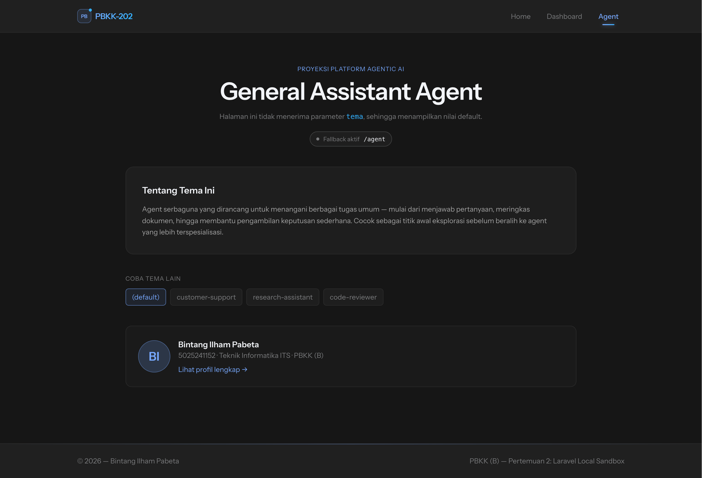
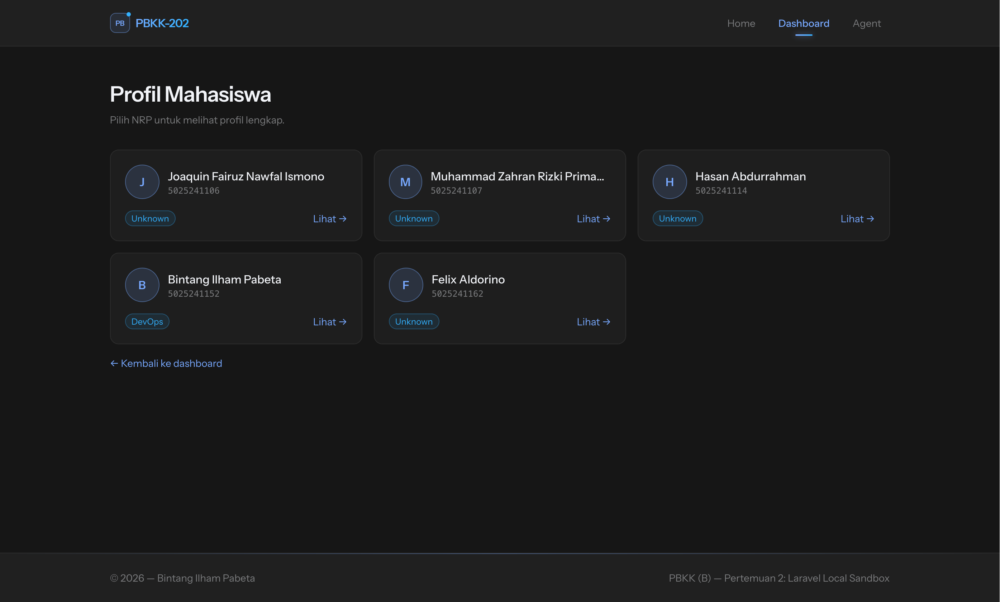
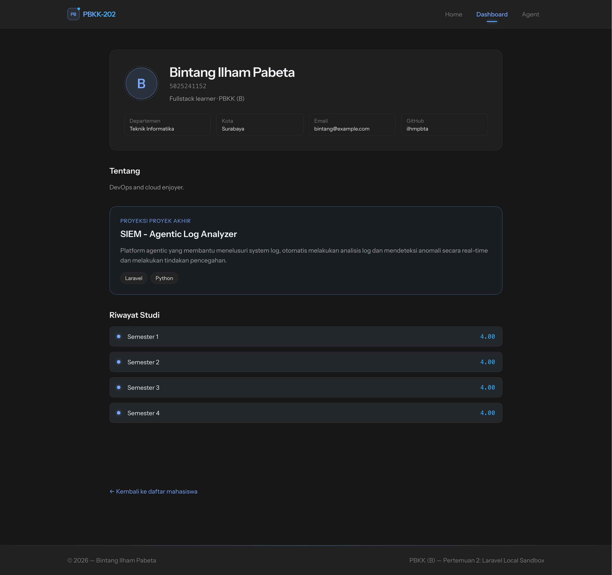
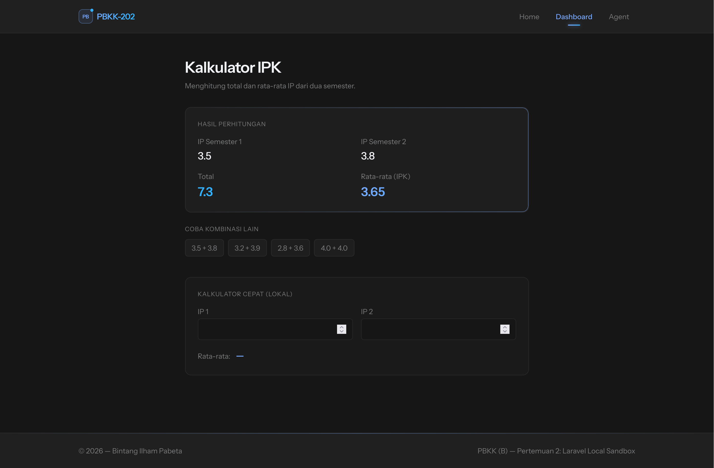
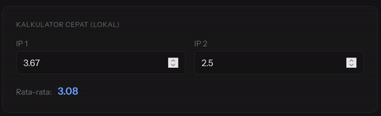

# PBKK-202

<p align="center">
    
</p>

> Laravel local routing sandbox — named routes, Blade components, and a small Agentic AI playground.


[Bintang Ilham Pabeta](https://github.com/ilhmpbta) · 5025241152 · PBKK (B)

## What's inside

- **Named routes & prefixes** — `dashboard.*` group, optional params, regex constraint on NRP
- **Blade components** — `navbar`, `footer`, `student-profile` with props
- **Agentic AI sandbox** — `/agent/{tema?}` with fallback handling
- **Student profiles** — dynamic page per NRP with study history and skills
- **IPK calculator** — server-side compute with live animated preview
- **Dark UI** — Tailwind v4, scroll progress bar, reveal-on-scroll micro-animations

## Previews

| GET '/' - Landing page |
| :-: |
|  |

| GET '/dashboard' - Dashboard hub |
| :-: |
|  |

| GET '/agent/{tema?}' - Agentic AI sandbox |
| :-: |
|  |

| GET '/dashboard/mahasiswa' - Student list |
| :-: |
|  |

| GET '/dashboard/mahasiswa/{nrp}' - Student profile |
| :-: |
|  |

| GET '/dashboard/hitung-ipk/{ip1}/{ip2}' - IPK calculator |
| :-: |
|   |
|   |

## Routes

| Method | URI | Name | Description |
|---|---|---|---|
| `GET` | `/` | `welcome` | Landing page |
| `GET` | `/agent/{tema?}` | `agent` | Agentic AI sandbox |
| `GET` | `/dashboard` | `dashboard.home` | Dashboard hub |
| `GET` | `/dashboard/mahasiswa` | `dashboard.mahasiswa.index` | Student list |
| `GET` | `/dashboard/mahasiswa/{nrp}` | `dashboard.mahasiswa` | Student profile |
| `GET` | `/dashboard/hitung-ipk/{ip1}/{ip2}` | `dashboard.hitung-ipk` | IPK calculator |

## How To Run

1. Clone the repository: 
    ```bash
    git clone https://github.com/ilhmpbta/pbkk-202
    cd pbkk-202
    ```
2. Install dependencies: 
    ```bash
    composer install
    npm run build
    ```
3. Set up environment variables: 
    ```bash
    cp .env.example .env
    touch database/database.sqlite
    ```
4. Create database file: 
    ```bash
    php artisan migrate
    ```
5. Run the application: 
    ```bash
    php artisan serve
    ```

> Note:  
> For windows, use New-Item instead of touch, copy instead of cp.
